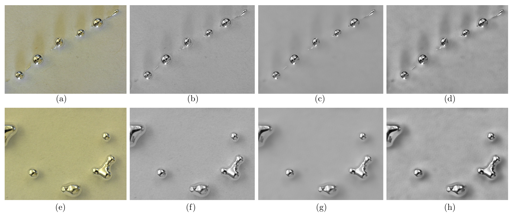
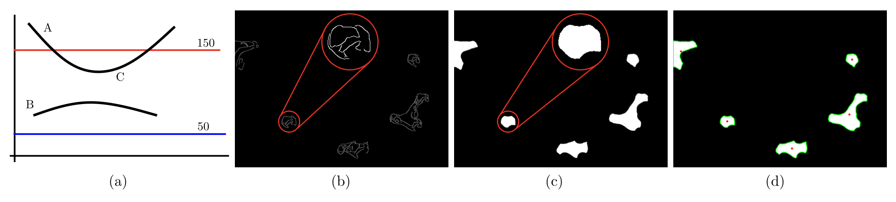
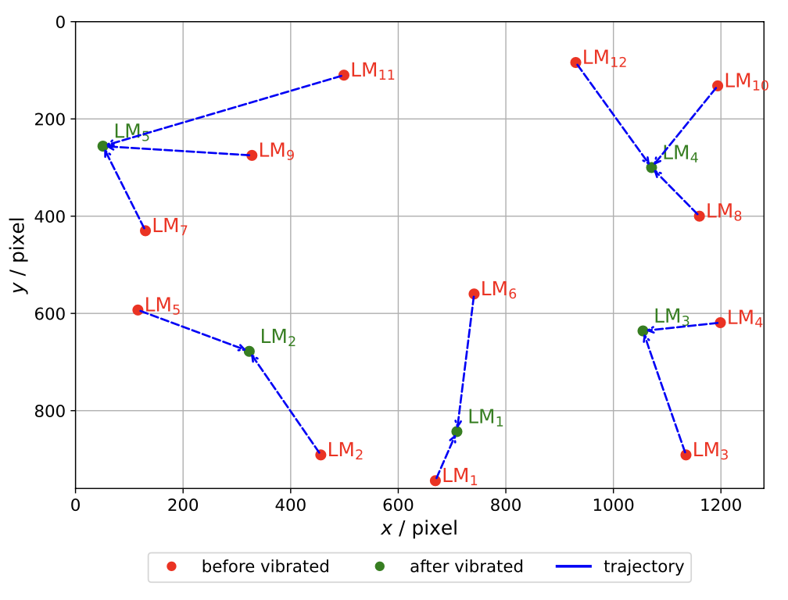

# From Pixels to Patterns: Computer Vision Based Identification and Tracking of Liquid Metal Droplets

This repository contains the code, data, and methods used to analyze the behavior of liquid metal (LM) droplets under substrate vibration. It includes an image processing pipeline for detecting and tracking LM droplets from microscope video sequences, and feature extraction.

---

## Project Structure

- `frames_video/` – Original video file of LM droplet extrusion under vibration and extracted frames
- `model/` - DnCNN models
- `DCT_IDCT.py` – Blockwise DCT and IDCT functions for denoising  
- `DnCNN.py` – Deep learning-based denoising network  
- `run_main.py` – Main script for image preprocessing and feature extraction  
- `README.md` – Project documentation  
- `requirements.txt` – Required Python packages  

---

## Requirements

- Python 3.8+
- matplotlib==3.10.3
- numpy==2.2.6
- opencv_python==4.11.0.86
- pandas==2.2.3
- scipy==1.15.3
- torch==2.6.0

Install dependencies using:

```bash
pip install -r requirements.txt
```

---

## How to Run

### Step 1: Setup

Download or clone the repository:

```bash
git clone https://github.com/NyiNyi-14/LM_distribution.git
```

Make sure all scripts and videos are in the same directory.

### Step 2: Update the Working Directories

Before running the code, set the appropriate input and output paths in the script, `run_main.py`, to specify where the extracted frames and results should be saved.

### Step 3: Image Preprocessing

Run the main image processing pipeline:

```bash
python run_main.py
```

- This script will extract frames, apply DCT/IDCT, DnCNN denoising, CLAHE contrast enhancement, edge detection, and contour analysis.

---

## Outputs

- Step by step image preprocessing for (a-d) deforming and (e-h) merging case. 
    - (a,e) Original frames; 
    - (b,f) Grayscale conversion followed by DCT and IDCT to suppress high frequency components; 
    - (c,g) Denoising using DnCNN by removing the estimated noise; 
    - (d,h) Contrast enhancement applied to highlight droplet boundaries and improve separation from the background.



- Step by step feature extraction for merging case.
    - (a) Illustration of hysteresis thresholding, pixel A is a sure-edge, B is a non-edge, and C is considered an edge based on its connectivity to A;
    - (b) Edge detection output highlighting partially unclosed regions;
    - (c) Morphological closing operation to address the unclosed edges from edge detection;
    - (d) Contour extraction used to compute the centroid and area of each droplet.



- Spatial distribution of detected LM droplet centroids with unique identifiers and color coded labels.

<p align="center">
  
</p>

---

## Related Work

This project builds on image processing and scientific computing methods, including:

- DCT-based denoising
- Deep CNN-based denoising (DnCNN)
- Contrast enhancement (CLAHE)
- Edge detection & morphological operations
- Feature tracking

---

## Citation

If you use this work, please cite the related paper as follows:

---

## Author

**Nyi Nyi Aung** 

PhD Student, Mechanical and Industrial Engineering - LSU, USA

MSc, Sustainable Transportation and Electrical Power Systems - UniOvi, Spain

BE, Electrical Power - YTU, Myanmar <br>


**Adrian Stein, PhD**

Assistant Professor

Department of Mechanical and Industrial Engineering

Louisiana State University